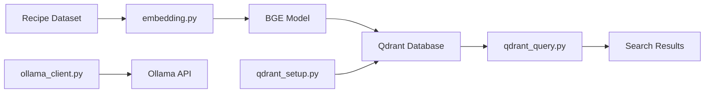

# Recipe Embedding & Vector Search System

A comprehensive system for processing recipe data, generating embeddings, and performing semantic search using Qdrant vector database.

## 🚀 Features

- **Recipe Data Processing**: Load and process recipe datasets (JSON/CSV formats)
- **Vector Embeddings**: Generate high-quality embeddings using BAAI/BGE models
- **Vector Database**: Store and query embeddings in Qdrant for fast similarity search
- **Resumable Processing**: Continue processing from where you left off if interrupted
- **Interactive Search**: Query recipes using natural language
- **Ollama Integration**: Connect with local Ollama instances for AI-powered features
- **Docker Support**: Easy Qdrant setup using Docker containers

## 📁 Project Structure

```
miniProj/
├── embedding.py                # Main embedding generation script
├── qdrant_query.py            # Interactive query tool for searching recipes
├── qdrant_setup.py            # Helper script for Qdrant Docker management
├── test_qdrant_connection.py  # Connection test and diagnostic tool
├── tune_config.py             # Configuration tuning tool for batch sizes
├── ollama_client.py           # Ollama API client integration
├── requirements.txt           # Python dependencies
├── rag_documents.json         # Processed recipe data (input)
├── RecipeNLG_dataset.csv      # Raw recipe dataset
├── DATA_TRANSFER_GUIDE.md     # Guide for transferring data between systems
├── qdrant_storage/            # Persistent Qdrant data directory (auto-created)
└── README.md                  # This file
```

## 🛠️ Installation

### Prerequisites

- Python 3.8+
- Docker (for Qdrant database)
- CUDA-compatible GPU (optional, for faster processing)

### 1. Clone and Setup

```bash
# Navigate to project directory
cd miniProj

# Install Python dependencies
pip install -r requirements.txt
```

### 2. Start Qdrant Database

**Option A: Using the helper script (Recommended)**

```bash
python qdrant_setup.py start
```

**Option B: Using Docker directly**

```bash
docker run -d --name qdrant_local -p 6333:6333 -p 6334:6334 qdrant/qdrant:latest
```

### 3. Verify Qdrant is Running

- Check status: `python qdrant_setup.py status`
- Test connection: `python test_qdrant_connection.py`
- Access dashboard: http://localhost:6333/dashboard
- API endpoint: http://localhost:6333

## 🎯 Usage

### 0. Test Connection & Configure (Recommended)

**Step 1: Test your Qdrant connection**

```bash
python test_qdrant_connection.py
```

**Step 2: Optimize configuration for your system**

```bash
python tune_config.py
```

If you experience connection errors, start with the `conservative` preset:

```bash
python tune_config.py conservative
```

This will verify connectivity and optimize batch sizes for stable processing.

### 1. Generate and Store Embeddings

Process your recipe dataset and store embeddings in Qdrant:

```bash
python embedding.py
```

**Features:**

- Processes recipes in configurable chunks with adaptive sub-batching
- Automatically resumes if interrupted
- Uses BGE-base-en-v1.5 model for high-quality embeddings
- Stores directly to Qdrant with connection resilience
- Smart retry logic with exponential backoff
- Memory-efficient processing with garbage collection

### 2. Search Recipes

Interactive search tool for querying your recipe database:

```bash
python qdrant_query.py
```

**Example queries:**

- "chocolate cake recipe"
- "healthy vegetarian meal"
- "quick lunch ideas"
- "spicy asian cuisine"

### 3. Manage Qdrant Database

Use the setup helper for database management:

```bash
# Start Qdrant
python qdrant_setup.py start

# Stop Qdrant
python qdrant_setup.py stop

# Check status
python qdrant_setup.py status

# Restart Qdrant
python qdrant_setup.py restart

# Backup data
python qdrant_setup.py backup

# Check storage info
python qdrant_setup.py storage
```

### 4. Data Transfer & Backup

Your Qdrant data is stored persistently in `qdrant_storage/` and can be transferred between systems:

**💾 Backup your embeddings:**

```bash
python qdrant_setup.py backup my_backup
```

**📦 Transfer to another system:**

```bash
# Compress the storage directory
tar -czf qdrant_data.tar.gz qdrant_storage/

# Transfer file to new system, then:
tar -xzf qdrant_data.tar.gz
python qdrant_setup.py start
```

**📖 Full transfer guide:** See [DATA_TRANSFER_GUIDE.md](DATA_TRANSFER_GUIDE.md) for detailed instructions.

## ⚙️ Configuration

### Embedding Configuration

Edit `embedding.py` to customize:

```python
# Processing
CHUNK_SIZE = 100000  # Recipes per batch

# Qdrant Settings
QDRANT_HOST = "localhost"
QDRANT_PORT = 6333
COLLECTION_NAME = "recipe_embeddings"

# Model
EMBEDDING_SIZE = 768  # BGE-base-en-v1.5 dimensions
```

### Query Configuration

Modify `qdrant_query.py` for custom search behavior:

```python
# Search parameters
limit = 5  # Number of results
score_threshold = 0.7  # Minimum similarity score
```

## 📊 Data Flow



1. **Data Input**: Raw recipes from `rag_documents.json`
2. **Processing**: Generate embeddings using BGE model
3. **Storage**: Store vectors and metadata in Qdrant
4. **Query**: Search using natural language queries
5. **Results**: Return similar recipes with relevance scores

## 🔧 Troubleshooting

### Connection Test Tool

**Test Qdrant connectivity before running embedding script:**

```bash
python test_qdrant_connection.py
```

This tool will:

- Test HTTP connectivity to Qdrant
- Verify Python client connection
- Check collection access permissions
- Test read/write operations
- Provide specific troubleshooting guidance

### Configuration Tuning

**If you experience connection issues, optimize batch sizes:**

```bash
python tune_config.py
```

**Quick preset options:**

- `conservative`: Small batches for connection stability
- `balanced`: Medium batches for general use
- `aggressive`: Large batches for maximum speed
- `minimal`: Tiny batches for severe connection issues

**Command line usage:**

```bash
python tune_config.py conservative  # Apply conservative preset
python tune_config.py show         # Show current settings
```

### Common Issues

**Qdrant Connection Error ([WinError 10053])**

```bash
# 1. Test connectivity first
python test_qdrant_connection.py

# 2. Check if Qdrant is running
python qdrant_setup.py status

# 3. Restart Qdrant
python qdrant_setup.py restart

# 4. Check Docker status
docker ps

# 5. Check Qdrant logs
docker logs qdrant_local
```

**Additional Windows-specific fixes:**

- Restart Docker Desktop
- Check Windows Firewall settings
- Try running PowerShell as Administrator

**CUDA Out of Memory**

```python
# Reduce batch size in embedding.py
embeddings = model.encode(
    texts,
    batch_size=16,  # Reduce from 32
    ...
)
```

**Progress Recovery**

```bash
# If embedding process is interrupted, simply restart
python embedding.py
# It will automatically resume from the last checkpoint
```

### Performance Optimization

- **GPU Usage**: Ensure CUDA is available for faster embedding generation
- **Batch Size**: Adjust based on your GPU memory
- **Chunk Size**: Larger chunks = fewer database writes but more RAM usage

## 🏗️ Architecture

### Components

1. **Embedding Generation** (`embedding.py`)
   - Loads recipe data from JSON
   - Generates embeddings using SentenceTransformers
   - Stores in Qdrant with chunked processing
   - Supports resume functionality

2. **Vector Search** (`qdrant_query.py`)
   - Semantic search using natural language
   - Returns ranked results with similarity scores
   - Collection statistics and random sampling

3. **Database Management** (`qdrant_setup.py`)
   - Docker container lifecycle management
   - Health checks and status monitoring
   - Easy start/stop/restart operations

4. **LLM Integration** (`ollama_client.py`)
   - Connects to local Ollama instances
   - Enables AI-powered recipe recommendations
   - Supports multiple model backends

## 📈 Performance

### Benchmarks

- **Embedding Generation**: ~1000 recipes/minute (RTX 3080)
- **Search Latency**: <100ms for similarity queries
- **Storage Efficiency**: ~3KB per recipe (768d vector + metadata)
- **Memory Usage**: ~2GB for 100K recipes during processing

## 🤝 Contributing

1. Fork the repository
2. Create a feature branch
3. Make your changes
4. Test thoroughly
5. Submit a pull request

## 📝 License

This project is open source. See the license file for details.

## 🆘 Support

- Check the troubleshooting section above
- Open an issue for bugs or feature requests
- Contribute improvements via pull requests

---

**Happy cooking and searching! 🍳🔍**
